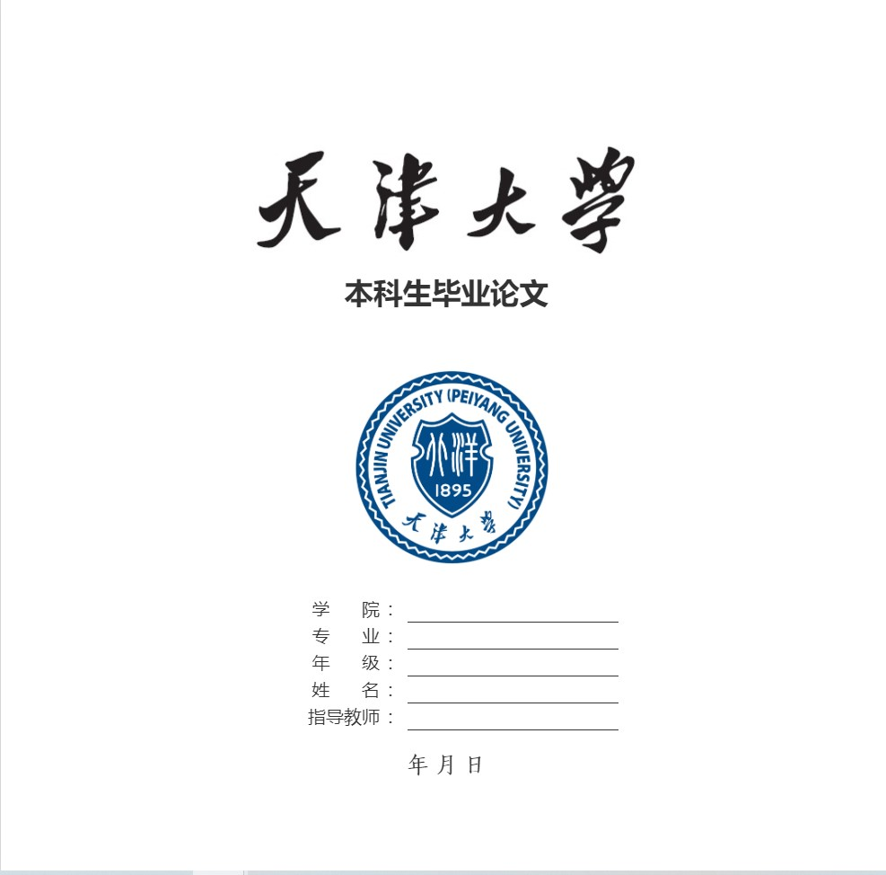

# 使用Typora代替LaTex编写论文

**本项目基于[typora-latex-theme](https://github.com/Keldos-Li/typora-latex-theme)进行二次开发，并将其适配成天津大学论文要求**

## 预览

[天津大学封面样式预览](Supplemental/tju-cover-template.pdf)

[论文样式预览](Supplemental/essay-template.pdf)

## 使用

由于本项目是基于[typora-latex-theme](https://github.com/Keldos-Li/typora-latex-theme)项目进行二次开发，且之后也需要根据该项目的变动进行追踪与修改。而关于本项目的使用在原项目的[README](https://github.com/Keldos-Li/typora-latex-theme/blob/main/README.md)中进行了详细地描述，关于本项目的使用您也可以在这里得到详细的指导。

由于本项目仅仅是最轻量级的排版，因此如果您需要更加复杂的排版需求，可以参考[天津大学LaTex排版](https://github.com/twtstudio/TJUThesisLatexTemplate)

## 反馈

由于本项目为`fork`项目，因此我们在本项目无法提出`issues`，因此本人新建了一个仓库用来接收`issues`

因此您可以：

- 向本项目提出[issues](https://github.com/KuangjuX/TJU-typora-latex-theme-issues/issues)
- 向原仓库提出[issues](https://github.com/Keldos-Li/typora-latex-theme/issues/new)
- 直接联系本人
- 加入群643187070进行交流

## 帮助

### Word字体与HTML字体对照

| word字字号 | word字体值（pt） | CSS字体值（px） |
| ---------- | ---------------- | --------------- |
| 初号       | 44pt             | 58.6px          |
| 小初       | 36pt             | 48px            |
| 一号       | 26pt             | 34.6px          |
| 小一       | 24pt             | 32px            |
| 二号       | 22pt             | 29.3px          |
| 小二       | 18pt             | 24px            |
| 三号       | 16pt             | 21.3px          |
| 小三       | 15pt             | 20px            |
| 四号       | 14pt             | 18.6px          |
| 小四       | 12pt             | 16px            |
| 五号       | 10.5pt           | 14px            |
| 小五       | 9pt              | 12px            |
| 六号       | 7.5pt            | 10px            |
| 小六       | 6.5pt            | 8.6px           |
| 七号       | 5.5pt            | 7.3px           |
| 八号       | 5pt              | 6.6px           |

